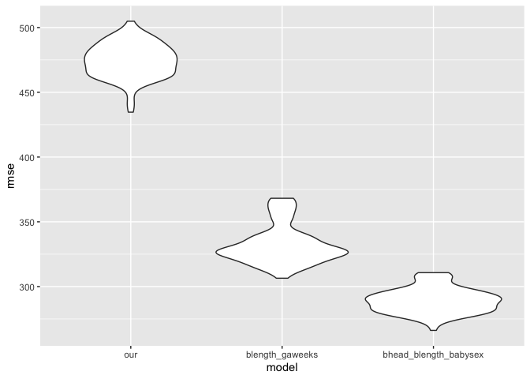

p8105_hw6
================
Renee Wang UNI:hw2851
12/4/2021

# Problem 1

read and clean data

``` r
birth_weight_df
```

    ## # A tibble: 4,342 × 20
    ##    babysex bhead blength   bwt delwt fincome frace gaweeks malform menarche
    ##    <fct>   <dbl>   <dbl> <dbl> <dbl>   <dbl> <fct>   <dbl> <fct>      <dbl>
    ##  1 female     34      51  3629   177      35 White    39.9 absent        13
    ##  2 male       34      48  3062   156      65 Black    25.9 absent        14
    ##  3 female     36      50  3345   148      85 White    39.9 absent        12
    ##  4 male       34      52  3062   157      55 White    40   absent        14
    ##  5 female     34      52  3374   156       5 White    41.6 absent        13
    ##  6 male       33      52  3374   129      55 White    40.7 absent        12
    ##  7 female     33      46  2523   126      96 Black    40.3 absent        14
    ##  8 female     33      49  2778   140       5 White    37.4 absent        12
    ##  9 male       36      52  3515   146      85 White    40.3 absent        11
    ## 10 male       33      50  3459   169      75 Black    40.7 absent        12
    ## # … with 4,332 more rows, and 10 more variables: mheight <dbl>, momage <dbl>,
    ## #   mrace <fct>, parity <dbl>, pnumlbw <dbl>, pnumsga <dbl>, ppbmi <dbl>,
    ## #   ppwt <dbl>, smoken <dbl>, wtgain <dbl>

After cleaning the data , we have seen variable “pnumsga” and “pnumlbw”
are all 0 across the dataset, and variable “parity”and “malform” have
less than five values included, so we exclude those variables and take
the others as the predictors.

Low birth weight is a major public health problem. As such, there is a
large number of research literature studying the underlying factors that
may affect birth weight, so we decide to choose the predictors based on
existing research. In particular, we referred to this article: Metgud,
Chandra S., Vijaya A. Naik, and Maheshwar D. Mallapur. “Factors
affecting birth weight of a newborn–a community based study in rural
Karnataka, India.” PloS one 7.7 (2012): e40040. The authors identified a
few factors that are significantly associated with birth weight:
exposure to passive smoking, age at first pregnancy, birth interval,
weight gain during pregnancy, etc. We checked this list of factors
against the given dataset and decide to use the following variables as
predictors: babysex, delwt, fincome, malform, momage, smoken and wtgain.

The next step is to decide a model to use. Based on the literature, many
of these factors has non-linear impact on birth weight. Thus, we decide
to use glm instead of lm.

``` r
fit = glm(bwt ~ babysex + delwt + fincome + malform + momage + smoken + wtgain, data = birth_weight_df)
birth_weight_df %>%
  modelr::add_residuals(fit) %>%
  modelr::add_predictions(fit) %>%
  ggplot(aes(x = pred, y = resid)) + geom_point() + geom_smooth(method='lm') +
  labs(
    x = "Fitted values",
    y = "Residuals",
    title = "Birth weight prediction model residuals against fitted values"
  )
```

    ## `geom_smooth()` using formula 'y ~ x'

<!-- -->
Looking at the plot, residuals are centered around 0 and are mostly
symmetrical. This can also be seen from the lm regression line we added
to the plot. There are a few outliers, but for most of the data points
we are making a reasonable prediction with a small residual.

Now we compare our model against the other two models, using cross
validation.

``` r
cv_df =
  crossv_mc(birth_weight_df, 100) %>%
  mutate(
    train = map(train, as_tibble),
    test = map(test, as_tibble)
  ) %>%
  mutate(
    our_method = map(train, ~glm(bwt ~ babysex + delwt + fincome + malform + momage + smoken + wtgain, data = .x) ),
    blength_gaweeks_method = map(train, ~glm(bwt ~ blength + gaweeks, data = .x)),
    bhead_blength_babysex_method = map(train, ~glm(bwt ~ bhead * blength * babysex, data = .x))
  ) %>%
  mutate(
    rmse_our = map2_dbl(our_method, test, ~rmse(model = .x, data = .y)),
    rmse_blength_gaweeks = map2_dbl(blength_gaweeks_method, test, ~rmse(model = .x, data = .y)),
    rmse_bhead_blength_babysex = map2_dbl(bhead_blength_babysex_method, test, ~rmse(model = .x, data = .y))
  )
```

We post-process the cross-validation result a bit to get the violin plot
of the RMSE errors of the three models:

``` r
cv_df %>% 
  select(starts_with("rmse")) %>% 
  pivot_longer(
    everything(),
    names_to = "model", 
    values_to = "rmse",
    names_prefix = "rmse_") %>% 
  mutate(model = fct_inorder(model)) %>%
  ggplot(aes(x = model, y = rmse)) + geom_violin()
```

<!-- -->
From the plot, it’s clear that the model using head circumference,
length, sex, and all interactions is the best-performing one, with mean
RMSE of 288.8293304; the model using length at birth and gestational age
is the second best performing, with mean RMSE of 332.7123367. Our model,
unfortunately, performs worse than the other two models with mean RMSE
of 475.4717995.
