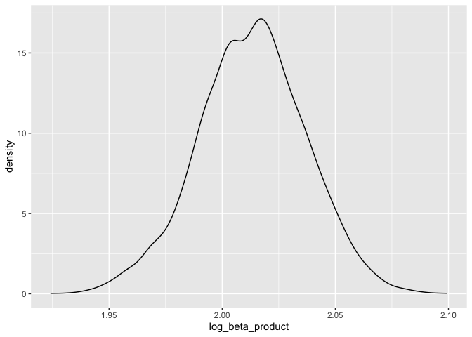

p8105_hw6
================
Renee Wang UNI:hw2851
12/4/2021

# Problem 1

We first read and clean the data:

``` r
birth_weight_df = 
  read_csv("./birthweight.csv") %>%
  na.omit() %>%
  mutate(
   babysex = recode_factor(babysex, "1" = "male", "2" = "female"),
    frace = recode_factor(frace, "1" = "White", "2" = "Black", "3" = "Asian", "4" = "Puerto Rican", "8" = "Other", "9" = "Unkown"),
    mrace = recode_factor(mrace, "1" = "White", "2" = "Black", "3" = "Asian", "4" = "Puerto Rican", "8" = "Other"),
    malform = recode_factor(malform, "0" = "absent", "1" = "present")
  )
```

The dataset has 4342 rows. We notice that after removing rows with NA
values the row count is still 4342, meaning that the dataset doesn’t
contain NA values. We also notice variables “pnumsga” and “pnumlbw” are
all 0 across the dataset by using the `unique` function, so we don’t use
these variables as predictors.

Low birth weight is a major public health problem. There is a large
number of research literature studying the underlying factors that may
affect birth weight, so we decide to choose the predictors based on
existing research. In particular, we referred to this article: Metgud,
Chandra S., Vijaya A. Naik, and Maheshwar D. Mallapur. “Factors
affecting birth weight of a newborn–a community based study in rural
Karnataka, India.” PloS one 7.7 (2012): e40040. The authors identified a
few factors that are significantly associated with birth weight:
exposure to passive smoking, age at first pregnancy, birth interval,
weight gain during pregnancy, etc. We checked this list of factors
against the given dataset and decide to use the following variables as
predictors: babysex, delwt, fincome, malform, momage, smoken and wtgain.

The next step is to decide a model to use. Based on the literature, many
of these factors has non-linear impact on birth weight. Thus, we decide
to use glm instead of lm.

``` r
fit = glm(bwt ~ babysex + delwt + fincome + malform + momage + smoken + wtgain, data = birth_weight_df)
birth_weight_df %>%
  modelr::add_residuals(fit) %>%
  modelr::add_predictions(fit) %>%
  ggplot(aes(x = pred, y = resid)) + geom_point() + geom_smooth(method='lm') +
  labs(
    x = "Fitted values",
    y = "Residuals",
    title = "Birth weight prediction model residuals against fitted values"
  )
```

    ## `geom_smooth()` using formula 'y ~ x'

<!-- -->
Looking at the plot, residuals are centered around 0 and are mostly
symmetrical. This can also be seen from the lm regression line we added
to the plot. There are a few outliers, but for most of the data points
we are making a reasonable prediction with a small residual.

Now we compare our model against the other two models, using cross
validation.

``` r
cv_df =
  crossv_mc(birth_weight_df, 100) %>%
  mutate(
    train = map(train, as_tibble),
    test = map(test, as_tibble)
  ) %>%
  mutate(
    our_method = map(train, ~glm(bwt ~ babysex + delwt + fincome + malform + momage + smoken + wtgain, data = .x) ),
    blength_gaweeks_method = map(train, ~glm(bwt ~ blength + gaweeks, data = .x)),
    bhead_blength_babysex_method = map(train, ~glm(bwt ~ bhead * blength * babysex, data = .x))
  ) %>%
  mutate(
    rmse_our = map2_dbl(our_method, test, ~rmse(model = .x, data = .y)),
    rmse_blength_gaweeks = map2_dbl(blength_gaweeks_method, test, ~rmse(model = .x, data = .y)),
    rmse_bhead_blength_babysex = map2_dbl(bhead_blength_babysex_method, test, ~rmse(model = .x, data = .y))
  )
```

We post-process the cross-validation result a bit to get the violin plot
of the RMSE errors of the three models:

``` r
cv_df %>% 
  select(starts_with("rmse")) %>% 
  pivot_longer(
    everything(),
    names_to = "model", 
    values_to = "rmse",
    names_prefix = "rmse_") %>% 
  mutate(model = fct_inorder(model)) %>%
  ggplot(aes(x = model, y = rmse)) + geom_violin()
```

<!-- -->
From the plot, it’s clear that the model using head circumference,
length, sex, and all interactions is the best-performing one, with mean
RMSE of 289.8651621; the model using length at birth and gestational age
is the second best performing, with mean RMSE of 334.9889326. Our model,
unfortunately, performs worse than the other two models with mean RMSE
of 474.5325911.

## Problem 2

We first load the Central Park weather data:

``` r
weather_df = 
  rnoaa::meteo_pull_monitors(
    c("USW00094728"),
    var = c("PRCP", "TMIN", "TMAX"), 
    date_min = "2017-01-01",
    date_max = "2017-12-31") %>%
  mutate(
    name = recode(id, USW00094728 = "CentralPark_NY"),
    tmin = tmin / 10,
    tmax = tmax / 10) %>%
  select(name, id, everything())
```

Then generate 5,000 bootstrap samples, fit a linear regression model
tmax \~ tmin for each:

``` r
bootstrap_results =
  weather_df %>%
  modelr::bootstrap(n = 5000) %>%
  mutate(
    models = map(strap, ~ lm(tmax ~ tmin, data = .x)),
    results = map(models, broom::tidy),
    coef = map(models, broom::glance)
  )
```

Extract *r̂*<sup>2</sup>:

``` r
r_squared =
  bootstrap_results %>%
  select(.id, coef) %>%
  unnest(coef)
```

Here we identify the 2.5% and 97.5% quantiles to provide a 95%
confidence interval for *r̂*<sup>2</sup>:

``` r
r_squared %>%
  summarize(
    r_squared_ci_lower = quantile(r.squared, 0.025),
    r_squared_ci_upper = quantile(r.squared, 0.975)
  ) %>%
  knitr::kable()
```

| r_squared_ci_lower | r_squared_ci_upper |
|-------------------:|-------------------:|
|          0.8929949 |          0.9270788 |

Then we plot the distribution of *r̂*<sup>2</sup>:

``` r
r_squared %>%
  ggplot(aes(x = r.squared)) + geom_density()
```

<!-- --> It
roughly follows normal distribution with mean around 0.913.

Similarly, we compute log(beta_0 \* beta_1):

``` r
log_beta_products =
bootstrap_results %>%
  select(.id, results) %>%
  unnest(results) %>%
  mutate(term = str_replace(term, "\\(Intercept\\)", "intercept")) %>%
  # take beta_0 and beta_1 per strap
  pivot_wider(.id,
              names_from = "term",
              values_from = "estimate") %>%
  mutate(log_beta_product = log(intercept * tmin))
```

Compute its 95% confidence interval:

``` r
log_beta_products %>%
  summarize(
    log_beta_product_ci_lower = quantile(log_beta_product, 0.025),
    log_beta_product_ci_upper = quantile(log_beta_product, 0.975)
  ) %>%
  knitr::kable()
```

| log_beta_product_ci_lower | log_beta_product_ci_upper |
|--------------------------:|--------------------------:|
|                  1.964271 |                  2.058733 |

Then plot its distribution:

``` r
log_beta_products %>%
  ggplot(aes(x = log_beta_product)) + geom_density()
```

<!-- -->

It also roughly follows normal distribution, with mean around 2.01.
